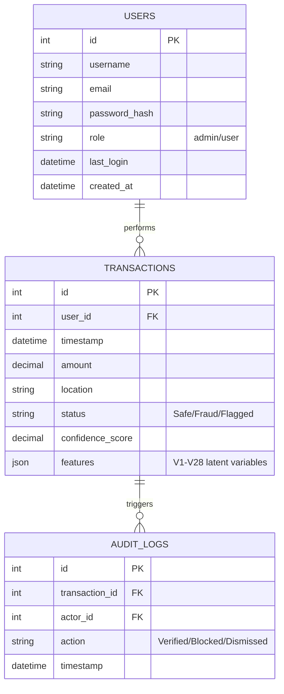

# Database Design: Neural CCFD

This document outlines the MySQL database schema and key analytical queries for the Neural CCFD system.

## 1. Entity Relationship Diagram



## 2. Schema Definition (SQL)

```sql
-- Create Database
CREATE DATABASE IF NOT EXISTS ccfd_db;
USE ccfd_db;

-- Users Table
CREATE TABLE IF NOT EXISTS users (
    id INT AUTO_INCREMENT PRIMARY KEY,
    username VARCHAR(50) NOT NULL UNIQUE,
    email VARCHAR(100) NOT NULL UNIQUE,
    password_hash VARCHAR(255) NOT NULL,
    role ENUM('admin', 'user') DEFAULT 'user',
    last_login DATETIME,
    created_at DATETIME DEFAULT CURRENT_TIMESTAMP
);

-- Transactions Table
CREATE TABLE IF NOT EXISTS transactions (
    id INT AUTO_INCREMENT PRIMARY KEY,
    user_id INT,
    timestamp DATETIME DEFAULT CURRENT_TIMESTAMP,
    amount DECIMAL(15, 2) NOT NULL,
    location VARCHAR(255),
    status ENUM('Safe', 'Fraud', 'Flagged', 'Blocked') DEFAULT 'Safe',
    confidence_score DECIMAL(5, 4),
    features JSON, -- Storing V1-V28 as a JSON object for flexibility
    FOREIGN KEY (user_id) REFERENCES users(id)
);

-- Audit Logs Table
CREATE TABLE IF NOT EXISTS audit_logs (
    id INT AUTO_INCREMENT PRIMARY KEY,
    transaction_id INT,
    actor_id INT,
    action VARCHAR(50),
    timestamp DATETIME DEFAULT CURRENT_TIMESTAMP,
    FOREIGN KEY (transaction_id) REFERENCES transactions(id),
    FOREIGN KEY (actor_id) REFERENCES users(id)
);
```

## 3. Analytical Queries

### 3.1. General Statistics
```sql
-- Total Transactions and Fraud Rate
SELECT 
    COUNT(*) as total_count,
    SUM(CASE WHEN status = 'Fraud' THEN 1 ELSE 0 END) as fraud_count,
    (SUM(CASE WHEN status = 'Fraud' THEN 1 ELSE 0 END) / COUNT(*)) * 100 as fraud_rate
FROM transactions;
```

### 3.2. Geographic Risk Analysis
```sql
-- Top 5 locations with highest fraud volume
SELECT 
    location, 
    COUNT(*) as total_fraudulent_tx, 
    SUM(amount) as total_loss
FROM transactions
WHERE status = 'Fraud'
GROUP BY location
ORDER BY total_loss DESC
LIMIT 5;
```

### 3.3. User Behavior Monitoring
```sql
-- Detect users with more than 3 flagged transactions in the last 24 hours
SELECT 
    u.username, 
    t.user_id, 
    COUNT(*) as flagged_count
FROM transactions t
JOIN users u ON t.user_id = u.id
WHERE t.status = 'Flagged' 
AND t.timestamp >= NOW() - INTERVAL 1 DAY
GROUP BY t.user_id
HAVING flagged_count > 3;
```

### 3.4. High-Confidence Anomaly Detection
```sql
-- List transactions with confidence score > 0.95 and amount > $10,000
SELECT * 
FROM transactions
WHERE confidence_score > 0.95 
AND amount > 10000;
```

### 3.5. Audit History
```sql
-- Get review history for a specific transaction
SELECT 
    al.action, 
    al.timestamp, 
    u.username as reviewer
FROM audit_logs al
JOIN users u ON al.actor_id = u.id
WHERE al.transaction_id = 123
ORDER BY al.timestamp DESC;
```
